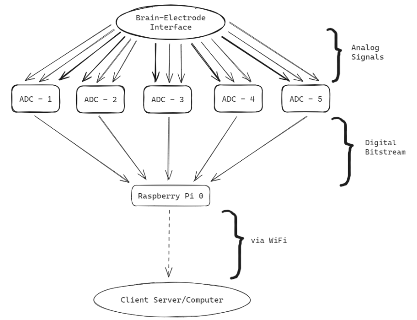

# Documentation
 
This is documentation regarding the Brain-Computer Interface (BCI) project being conducted at IIST Trivandrum. My part of the project aims to create the hardware for a BCI system.

We have used OpenBCI's Cyton Board as motivation for this project. It consists of a PIC32MX250F128B microcontroller and a Texas Instruments ADS1299 ADC suited for biopotential measurements. Gold plated electrodes are used to read the brain's EEG signals which are fed to the input of the ADC. Once the microcontroller has obtained the digital signal from the output of the ADC, it transmits this data to a computer running the OpenBCI software via a WiFi dongle.

To replicate this system, we have used a Raspberry Pi Zero W with WiFi networking capabilities and the 24 bit low noise, low power, 3 channel ADC AD7793. The electrodes are connected to 5 ADCs which totals to 15 accessible channels in total. The digital outputs of these ADCs are connected to the Raspberry Pi which then uses Python low level networking schemes to transfer this data to a client computer via WiFi.

A rudimentary diagram of the system is presented below.

<p align="center">
  
</p>

Before the arrival of the ADC, an Arduino UNO was used as a 10 bit ADC. The corresponding server Python script is located in `serverBCI.py` and the client script is located in `clientBCI.py`. The Arduino ino file to run the analog to digital conversion is located in `arduinoBCI.ino`.

The codes for the ADC are given in the files `AD7793.py` and `AD7793_read_example.py`.

Make the connections to the ADC as follows:

```
RPi Pin 1 (3.3V) ------> AD7793 Pin 10 (VDD)
RPi Pin 6 (GND) ------> AD7793 Pin 8 (GND)
RPi Pin 19 (MOSI) ----> AD7793 Pin 5 (DIN)
RPi Pin 21 (MISO) ----> AD7793 Pin 6 (DOUT)
RPi Pin 23 (SCLK) ----> AD7793 Pin 4 (SCLK)
RPi Pin 24 (CE0) -----> AD7793 Pin 7 (CS)
RPi (GPIO Pin) -------> AD7793 Pin 11 (RESET)
```